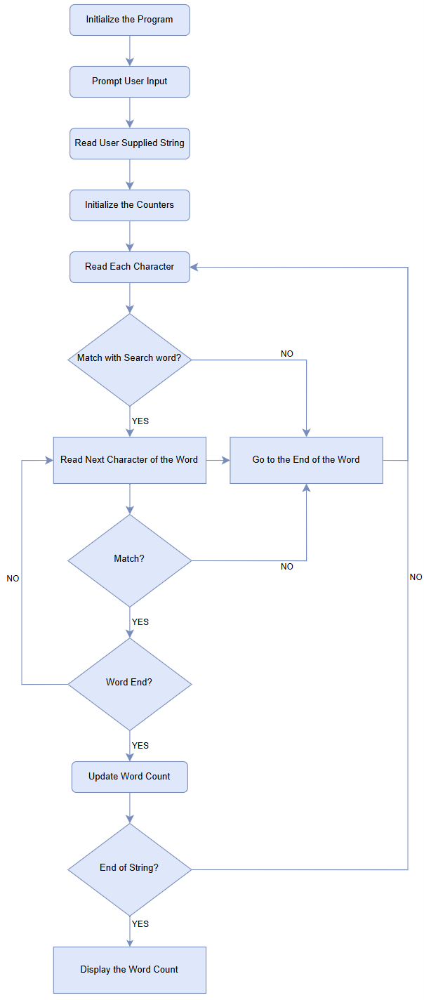
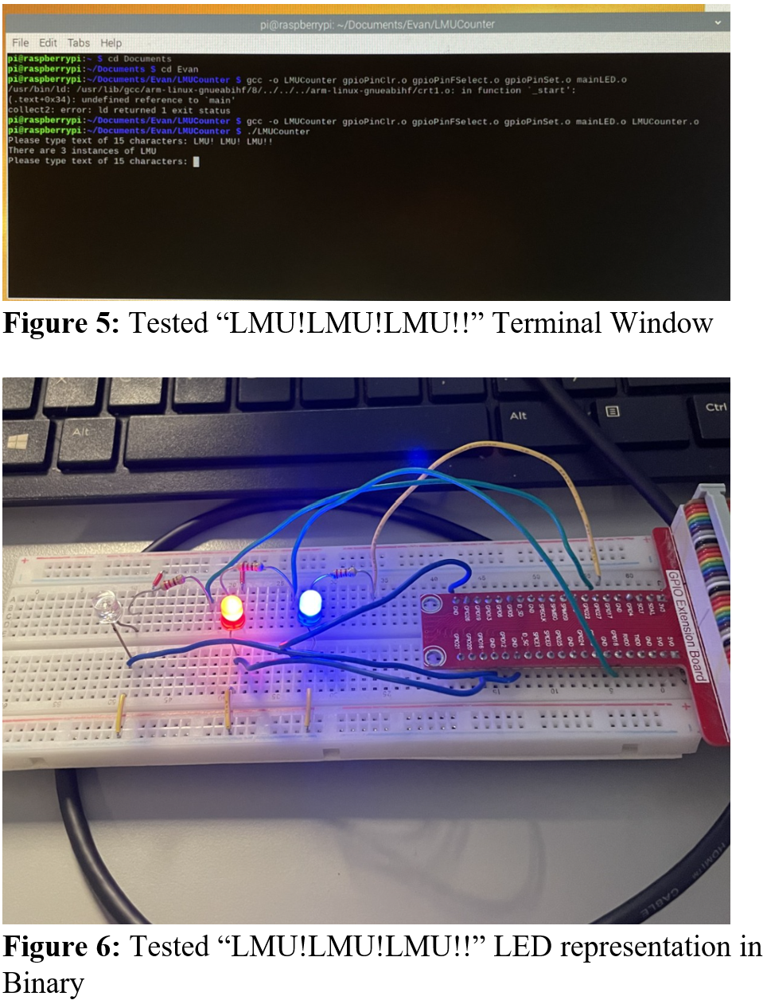
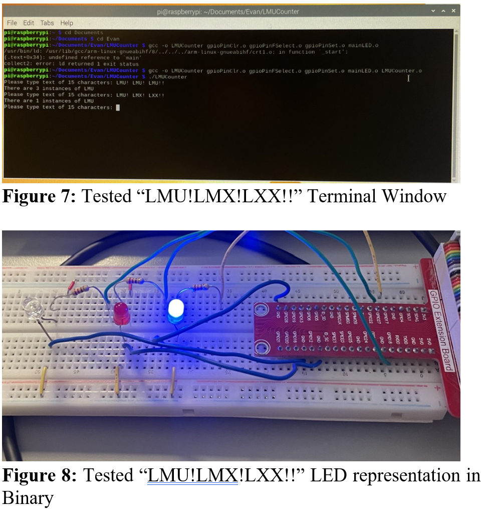

# ARM Assembly on Raspberry Pi

This project demonstrates low-level programming in ARM assembly on a Raspberry Pi, including direct hardware interaction using GPIO to display results through LEDs.

## Overview

The system processes a 15-character input string, counts occurrences of the substring "LMU", and outputs the result in two ways:

- Decimal output displayed on a monitor  
- Binary output displayed using GPIO-connected LEDs  

This project emphasizes low-level execution, memory control, and hardware-software integration.

## System Architecture

- ARM assembly program running on Raspberry Pi  
- GPIO control for LED output (pins 17, 18, 27)  
- Real-time user input processing  
- Infinite loop execution for continuous operation  

---

## Algorithm Design



The program follows a structured algorithm to read user input, scan for the substring "LMU", count occurrences, and output results. The flowchart illustrates the step-by-step logic used in the assembly implementation.

---

## Test Case 1



Input:

```
LMU!LMU!LMU!!
```


Output:
- Count = 3  
- LEDs display binary representation of 3  

---

## Test Case 2



Input:

```
LMU!LMX!LXX!!
```


Output:
- Count = 1  
- LEDs display binary representation of 1  

---

## Key Features

- ARM assembly string processing  
- Substring detection and counting  
- Direct GPIO control for hardware output  
- Binary representation using LEDs  
- Continuous execution loop  

---

## Files

- `docs/lmu-counter.pdf` — full assembly program and analysis  

---

## Skills Demonstrated

- Embedded systems programming  
- ARM assembly development  
- Hardware-software integration  
- GPIO interfacing  
- Low-level debugging and execution  

---

## Why This Project Matters

This project demonstrates control at the lowest level of computing, directly interfacing with hardware. It highlights the ability to move beyond high-level programming and work with system architecture, memory, and hardware control.

---

## Author

Joshua Oliveira